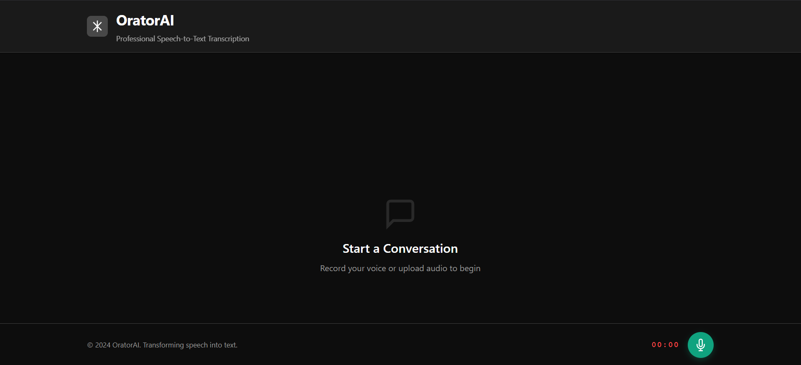
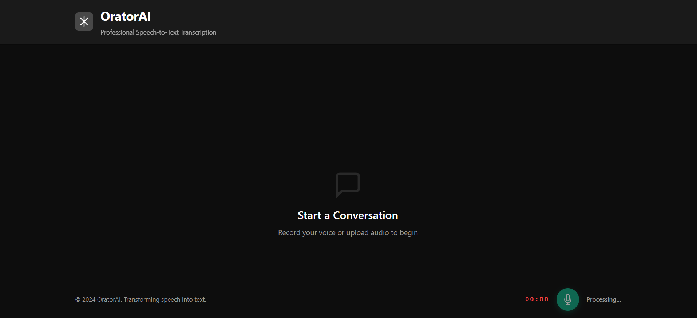
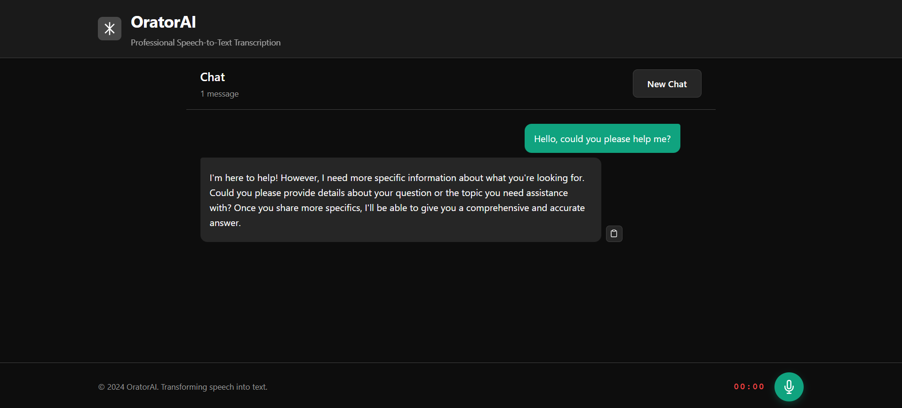

# OratorAI

## Executive Summary

OratorAI is an advanced intelligent audio processing platform designed to transcribe spoken content and transform informal speech into formal, professionally-written English text. The system leverages state-of-the-art machine learning models to deliver accurate speech-to-text conversion combined with sophisticated natural language processing for stylistic enhancement.

## Project Overview

OratorAI comprises a full-stack application architecture consisting of a RESTful backend service and a responsive web-based frontend interface. The platform enables users to upload audio files, receive accurate transcriptions, and obtain professionally refined versions of the transcribed content in formal English.

### Key Capabilities

- **Audio Transcription**: Utilizes OpenAI's Whisper model for accurate speech recognition across multiple languages
- **Formal Language Conversion**: Transforms casual speech patterns into formal, professional English
- **Language Detection**: Automatically identifies the language of spoken content
- **Web Interface**: Intuitive React-based user interface for seamless interaction
- **RESTful API**: Comprehensive backend API for audio processing operations

## System Architecture

### Technology Stack

#### Backend
- **Framework**: FastAPI 0.127.1
- **Speech Recognition**: OpenAI Whisper Model
- **Language Processing**: Advanced NLP pipeline
- **Server**: Uvicorn ASGI server
- **Language**: Python 3.11

#### Frontend
- **Framework**: React with Vite
- **Styling**: Tailwind CSS
- **Bundler**: Vite
- **Linting**: ESLint

### Project Structure

```
OratorAI/
├── backend/                 # FastAPI application
│   ├── main.py             # API endpoints and application entry point
│   ├── whisper_service.py  # Audio transcription service
│   ├── rewrite_service.py  # Formal text conversion service
│   ├── config.py           # Configuration settings
│   └── .env                # Environment variables
├── frontend/               # React application
│   ├── src/
│   │   ├── main.jsx        # Application entry point
│   │   ├── App.jsx         # Main application component
│   │   ├── ChatBot.jsx     # Chat interface component
│   │   ├── components/     # Reusable UI components
│   │   └── styles/         # Styling modules
│   ├── package.json        # Node.js dependencies
│   └── vite.config.js      # Vite configuration
├── env/                    # Python virtual environment
├── requirements.txt        # Python dependencies
└── .gitignore             # Git ignore patterns
```

## Installation and Setup

### Prerequisites

- Python 3.11 or higher
- Node.js 16 or higher
- pip package manager
- npm or yarn package manager

### Backend Setup

1. **Create and activate the Python virtual environment:**
   ```bash
   python -m venv env
   .\env\Scripts\activate
   ```

2. **Install Python dependencies:**
   ```bash
   pip install -r requirements.txt
   ```

3. **Configure environment variables:**
   Create a `.env` file in the `backend/` directory with necessary configurations.

4. **Initialize the backend service:**
   ```bash
   cd backend
   python main.py
   ```

The backend service will start on `http://0.0.0.0:8000`

### Frontend Setup

1. **Navigate to the frontend directory:**
   ```bash
   cd frontend
   ```

2. **Install Node.js dependencies:**
   ```bash
   npm install
   ```

3. **Start the development server:**
   ```bash
   npm run dev
   ```

The frontend application will be accessible at `http://localhost:5173`

## API Documentation

### Health Check Endpoint

**GET** `/health`

Returns the operational status of the API.

**Response:**
```json
{
  "status": "ok"
}
```

### Audio Transcription Endpoint

**POST** `/transcribe`

Processes uploaded audio files for transcription and formal text conversion.

**Request:**
- Content-Type: `multipart/form-data`
- Parameter: `file` (audio file)

**Response:**
```json
{
  "detected_language": "en",
  "original_text": "Transcribed text from audio",
  "formal_english": "Formally rewritten version of the text"
}
```

**Error Response:**
```json
{
  "error": "Error message description",
  "detected_language": "unknown",
  "original_text": "Error details",
  "formal_english": "Error details"
}
```

## Core Services

### Whisper Service (`whisper_service.py`)

Handles audio file processing and transcription using OpenAI's Whisper model. Supports multiple audio formats and automatically detects the spoken language.

### Rewrite Service (`rewrite_service.py`)

Transforms informal transcribed text into formal, professional English while preserving the original meaning and intent.

## User Interface

### Interface Screenshots

#### Screenshot 1: Home Interface


#### Screenshot 2: Audio Upload and Processing


#### Screenshot 3: Transcription Results


## Usage Examples

### Basic Transcription Request

```bash
curl -X POST -F "file=@audio_sample.wav" http://localhost:8000/transcribe
```

### Frontend Interface

1. Launch the frontend application
2. Upload an audio file through the user interface
3. View real-time transcription results
4. Review the formally rewritten version

## Development

### Running in Development Mode

**Backend:**
```bash
.\env\Scripts\activate
cd backend
python main.py
```

**Frontend:**
```bash
cd frontend
npm run dev
```

### Code Quality

The project maintains ESLint standards for frontend code consistency. Configuration details are available in `eslint.config.js`.

### Styling Guidelines

Frontend styling follows guidelines documented in `STYLE_GUIDE.md`.

## Dependencies

### Python Requirements

See `requirements.txt` for complete Python package dependencies.

### Node.js Requirements

See `frontend/package.json` for complete frontend dependencies.

## Environmental Configuration

Environment-specific settings are managed through `.env` files. Ensure sensitive information such as API keys are stored securely and not committed to version control.

## Performance Considerations

- The Whisper model requires initial loading time on first execution
- Audio file processing time depends on file duration and system specifications
- Concurrent request handling is managed by Uvicorn's worker pool

## Error Handling

The application implements comprehensive error handling across all services:
- Invalid audio file formats are rejected with descriptive error messages
- Processing failures are logged and reported to clients
- Temporary files are automatically cleaned up after processing

## Logging

Server operations are logged to `backend/server.log` for debugging and monitoring purposes.

## Contributing

Contributions to the OratorAI project should maintain code quality standards and adhere to the established project structure.

## License

All rights reserved. Proprietary software.

## Support

For technical inquiries or issues, refer to the project documentation and server logs for diagnostic information.

---

**Version**: 1.0.0  
**Last Updated**: January 2, 2026  
**Project Status**: Active Development
